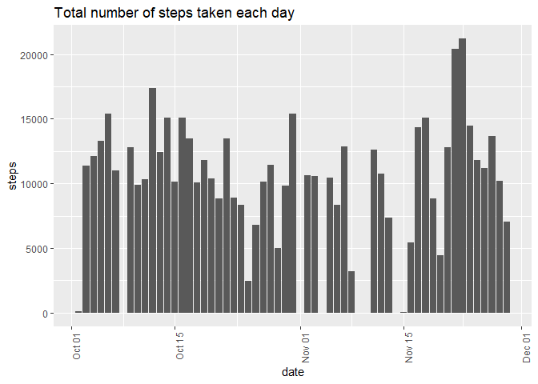
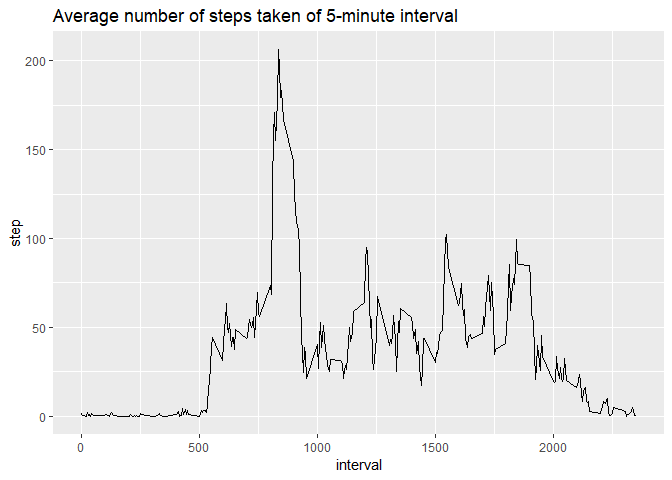
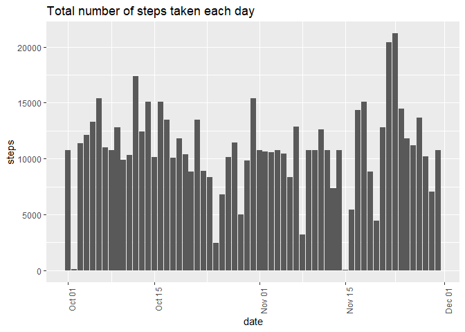
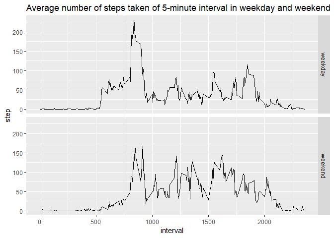

## Loading and preprocessing the data

```r
df <- read.csv('activity.csv')
df$date <- as.Date(df$date)
str(data)
```

```
function (..., list = character(), package = NULL, lib.loc = NULL, 
    verbose = getOption("verbose"), envir = .GlobalEnv)  
```


## What is mean total number of steps taken per day?

1.Make a histogram of the total number of steps taken each day


```r
ggplot(df,aes(x = date,y = steps)) + geom_bar(na.rm = F,stat="identity") + theme(axis.text.x = element_text(angle = 90, hjust = 1)) + ggtitle('Total number of steps taken each day')
```

```
Warning: Removed 2304 rows containing missing values (position_stack).
```

<!-- -->

2.Calculate and report the mean and median total number of steps taken per day


```r
results <- df %>% group_by(as.character(date)) %>% mutate(t_steps = sum(steps,na.rm = T))
results <- data.frame(Mean_steps = mean(results$t_steps),Median_steps = median(results$t_steps))
results <- xtable(results)
names(results) <- c('Mean_steps','Median_steps' )
print(results,type = 'html')
```

<!-- html table generated in R 3.5.1 by xtable 1.8-2 package -->
<!-- Sat Dec 14 22:11:14 2019 -->
<table border=1>
<tr> <th>  </th> <th> Mean_steps </th> <th> Median_steps </th>  </tr>
  <tr> <td align="right"> 1 </td> <td align="right"> 9354.23 </td> <td align="right"> 10395.00 </td> </tr>
   </table>

## What is the average daily activity pattern?

1.Make a time series plot (i.e. type = "l") of the 5-minute interval (x-axis) and the average number of steps taken, averaged across all days (y-axis)


```r
df1 <- df %>% group_by(interval) %>% summarise(step = mean(steps,na.rm = T))
```

```
Warning: The `printer` argument is deprecated as of rlang 0.3.0.
This warning is displayed once per session.
```

```r
ggplot(df1,aes(x = interval,y = step)) + geom_line() + ggtitle('Average number of steps taken of 5-minute interval')
```

<!-- -->

2.Find the 5-minute interval that contains the maximum number of steps


```r
df1$interval[which(df1$step == max(df1$step))]
```

```
[1] 835
```

## Imputing missing values

1.Calculate and report the total number of missing values in the dataset 


```r
t_NA <- sum(is.na(df))
paste('The total number of missing values in the dataset is',t_NA,'.')
```

```
[1] "The total number of missing values in the dataset is 2304 ."
```

2&3.Impute the missing value with the mean for that 5-minute interval


```r
df_new <- df %>% group_by(interval) %>% mutate(steps = ifelse(is.na(steps),mean(steps,na.rm = T),steps))
head(df_new)
```

```
# A tibble: 6 x 3
# Groups:   interval [6]
   steps date       interval
   <dbl> <date>        <int>
1 1.72   2012-10-01        0
2 0.340  2012-10-01        5
3 0.132  2012-10-01       10
4 0.151  2012-10-01       15
5 0.0755 2012-10-01       20
6 2.09   2012-10-01       25
```

4.Make a histogram of the total number of steps taken each day and calculate and report the mean and median total number of steps taken per day.


```r
ggplot(df_new,aes(x = date,y = steps)) + geom_bar(na.rm = F,stat="identity") + theme(axis.text.x = element_text(angle = 90, hjust = 1)) + ggtitle('Total number of steps taken each day')
```

<!-- -->


```r
results_new <- df_new %>% group_by(as.character(date)) %>% mutate(t_steps = sum(steps,na.rm = T))
results_new <- data.frame(Mean_steps = mean(results_new$t_steps),Median_steps = median(results_new$t_steps))
results_new <- xtable(results_new)
names(results_new) <- c('Mean_steps','Median_steps' )
print(results_new,type = 'html')
```

<!-- html table generated in R 3.5.1 by xtable 1.8-2 package -->
<!-- Sat Dec 14 22:11:15 2019 -->
<table border=1>
<tr> <th>  </th> <th> Mean_steps </th> <th> Median_steps </th>  </tr>
  <tr> <td align="right"> 1 </td> <td align="right"> 10766.19 </td> <td align="right"> 10766.19 </td> </tr>
   </table>

The two values are both greater than the estimates from the first part of the assignment because we use the mean values of steps in each 5-minute inteval, which are greater than 0, to impute the missing values (which are 0 when we set na.rm = T in the first part.)

## Are there differences in activity patterns between weekdays and weekends?

1.Create a new factor variable in the dataset with two levels -- "weekday" and "weekend" indicating whether a given date is a weekday or weekend day.


```r
weekday_list <- c('Monday', 'Tuesday', 'Wednesday', 'Thursday', 'Friday')
df_new1 <- df_new %>% mutate(weekday = weekdays(date)) %>% mutate(weekday = ifelse(weekday %in% weekday_list,'weekday','weekend'))
df_new1$weekday <- as.factor(df_new1$weekday)
```

2.Make a panel plot containing a time series plot of the 5-minute interval (x-axis) and the average number of steps taken, averaged across all weekday days or weekend days (y-axis). 


```r
df1_new <- df_new1 %>% group_by(interval,weekday) %>% summarise(step = mean(steps,na.rm = T))
ggplot(df1_new,aes(x = interval,y = step)) + geom_line() + facet_grid(weekday ~ .) + ggtitle('Average number of steps taken of 5-minute interval in weekday and weekend')
```

<!-- -->
